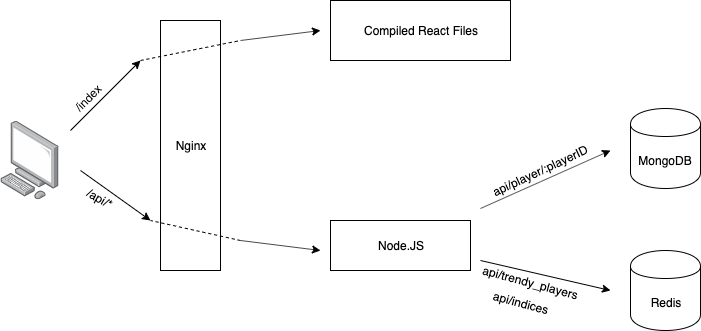
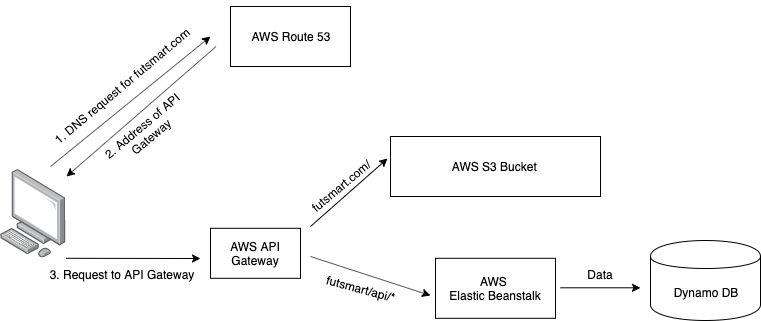

## About Futsmart  
Please feel free to explore our website at www.futsmart.com  

The purpose of this website is to help gamers of an EA video soccer game, FIFA20, to find the best trading strategy of player cards. It provides information on trading market index, player card prices and price fluctuations.  

There are other trading info websites for FIFA20 on the market. But we find their market index doesn't reflect the market trend very accurately. Besides, the rankings for price fluctuations on those websites do not differentiate the types of cards, namely gold and icon. So we decided to make our own FIFA20 trading strategy website to provide better trading information.  

## Architecture
* Frontend: React App
* Backend: Node.js
* Data storage:  
    1. NoSQL database (DynamoDB by AWS)  
    2. Redis and MongoDB running in docker container (previously used for dev; have been replaced by DynamoDB)

Detailed information will be provided in the sections below.

## Two Deployments  
We have two different deployments, one for development and the other for production.  

### Deployment for Dev ENV  
This implementation aims for faster and easier deployment.  
The website is deployed to an AWS Lightsail instance. The Redis and MongoDB databases run in docker container. And we used Nginx to serve static files and do reverse proxy.   
Please see the following diagram for details.  

### Deployment for Prod ENV
This deployment features stability and scalability, by leveraging various AWS services, including `S3, Elastic Beanstalk, DynamoDB, API Gateway and Route 53`.    
Please refer to the following diagram.  

## Frontend
The frontend is built using `React`.
Currently our website has three main pages, Home, Player Fluctuation Ranking, and Player Profile. To build a single-page app and avoid page refreshing as user navigates, I used `React Router` to create client-side routing to each page.  
The React App is implemented completely with React Functional Components.  
The presentation of the web pages are implemented with a combination of `Bootstrap` framework and highly customized React components (in-line styling).

## Backend and Data Storage
The backend is built with Node.js and Express framework.  
There are 3 API:  
1. /api/indices
2. /api/trendy_players
3. /api/player/:playerID  

Previously we used `Redis` and `MongoDB`. But now we migrated to `AWS DynamoDB`.  

Both of the first two API asynchronously retrieve data saved under different keys in DynamoDB. This means the Node.js app needs to know when all asynchronous operations complete. To achieve it, I used the batchGet() method of the AWS.DynamoDB.DocumentClient class.

